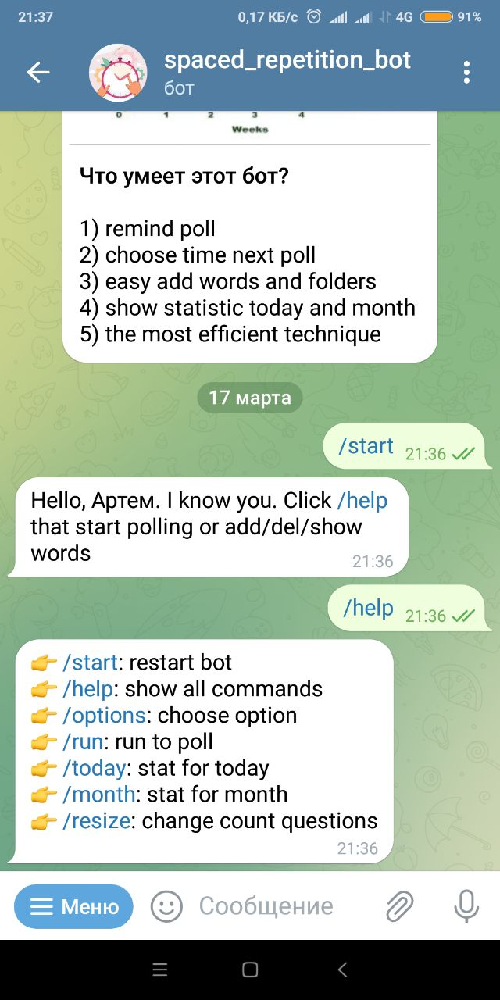

# Space repetition bot

---
The async bot allows you to learn words using spaced repetition technique.
This method back in 1930 showed the highest result in memorizing words.
In subsequent, mathematics and cognitive psychologists confirmed this practice as the most effective.
The bot will remind you of your next survey.
You should stick to the Forgetting Curve
---
The bot will remind you of each poll. You choose at what pace to memorize the words.
It's easy to add words and divide them into folders.
You have daily and monthly statistics tracking in your hands.
---
Our memory tends to forget things we don't practice every 4 days.
Memorizing words does not require cramming and spaced repetition.

## You can read:

* about space repetition in https://en.wikipedia.org/wiki/Spaced_repetition
* about curve forgetting in https://en.wikipedia.org/wiki/Forgetting_curve

## Advantages async bot

1) 📨 remind poll
2) ⏲ choose time next poll
3) 🖊 easy add words and folders
4) 📈 show statistic today and month
5) 🧐 the most efficient technique

## Commands

| command  | description            |
|----------|------------------------|
| /start   | restart bot            |
| /help    | show all commands      |
| /options | choose option          |
| /run     | run to poll            |
| /today   | stat for today         |
| /month   | stat for month         |
| /resize  | change count questions |
